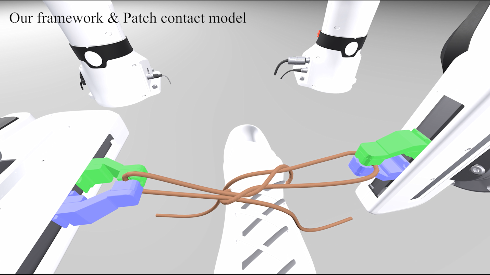

# Drake-DER

This is a custom branch of Drake for simulating slender deformable objects. Visit [here](examples/multibody/filament/) for examples.

For general information, visit [Drake Documentation](https://drake.mit.edu).

    

